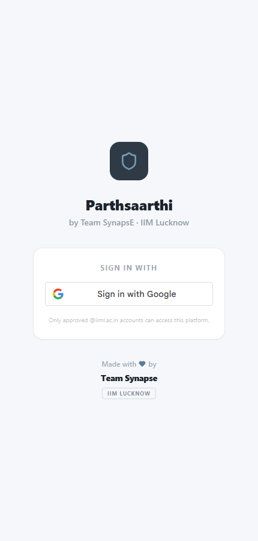
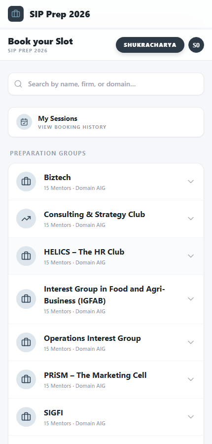
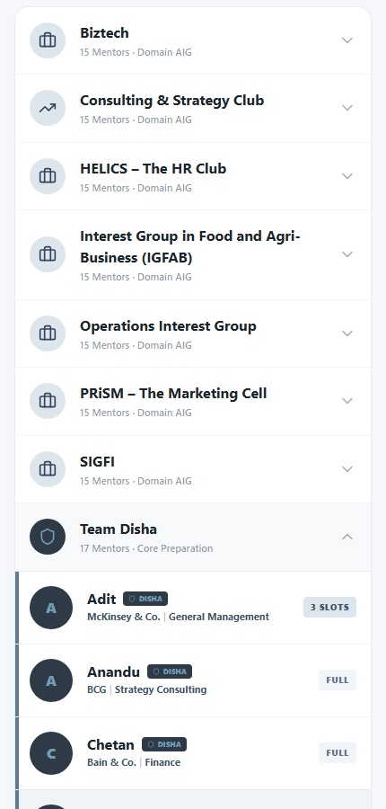
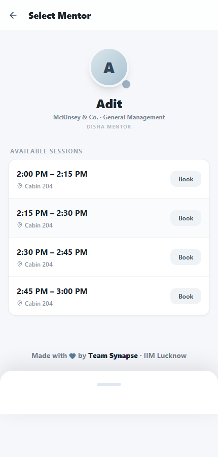
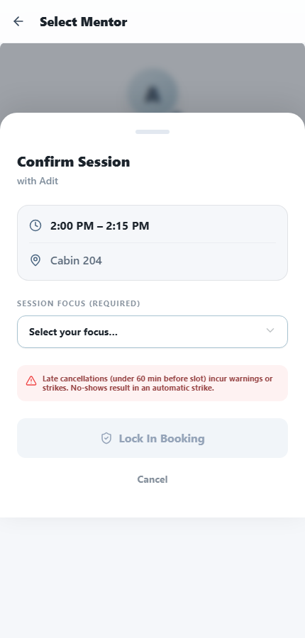
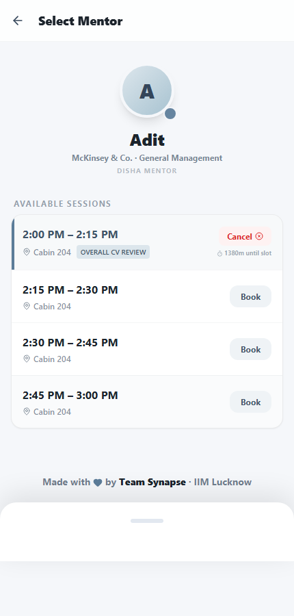
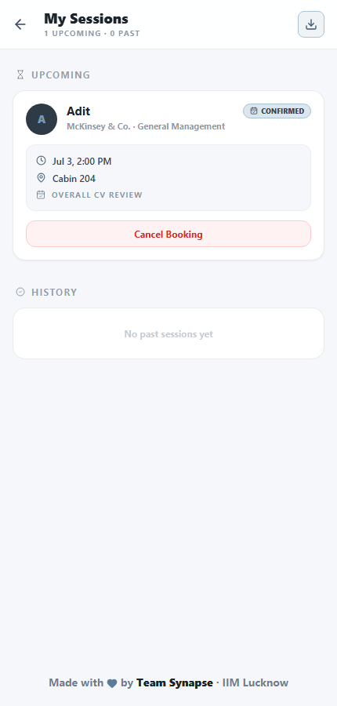
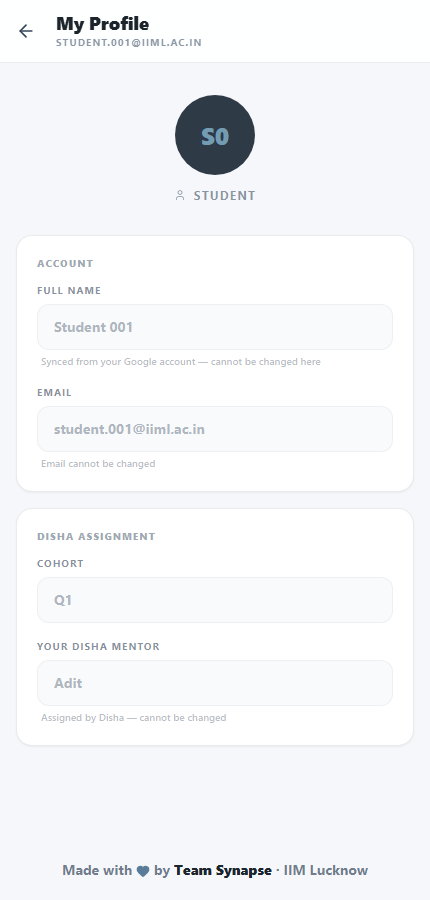

# Parthsaarthi — Student Guide

A quick walkthrough of how to book a CV-review session with your mentor on
Parthsaarthi, IIM Lucknow's SIP Prep booking platform.

> Screenshots below are from a synthetic demo account, not real student data.

---

## 1. Sign in

Go to the Parthsaarthi login page and sign in with your **@iiml.ac.in Google
account**. Only whitelisted accounts can access the platform — if you get an
"not authorised" message, contact your Disha mentor or the Placement
Committee to confirm you've been added.

---

## 2. Your dashboard

After signing in you land on **Book your Slot** — your home screen. From
here you can:

- **Search** any mentor by name, firm, or domain
- Open **My Sessions** to see your booking history
- Browse **Preparation Groups** — Team Disha (your assigned Disha mentor) and
  the seven domain AIGs (Biztech, Consulting & Strategy, HELICS, IGFAB,
  Operations, PRiSM, SIGFI)

---

## 3. Find your mentor

Tap **Team Disha** to expand the group and see all Disha mentors. Each entry
shows the mentor's firm/domain and how many slots they currently have open —
**FULL** means fully booked right now, check back later. Tap a mentor's name
to open their available sessions. Domain AIG mentors (Biztech, Consulting,
etc.) work the same way — expand that group instead.

---

## 4. Pick a slot

On a mentor's page you'll see their **Available Sessions** — each a 15-minute
(or mentor-set duration) block with a time and venue. Tap **Book** on the
slot that works for you.

---

## 5. Confirm your session

A confirmation sheet slides up. Select a **Session Focus** — Overall CV
Review, Work Experience, or POR/ECA — then tap **Lock In Booking**.

⚠️ Read the cancellation notice before confirming: cancelling **under 60
minutes** before your slot, or not showing up, results in a warning or
strike against your account. Repeated strikes lead to a temporary booking
ban — see [§7](#7-cancelling--penalties) below.

Once confirmed, the slot updates immediately to show your booking:

You'll also get a **confirmation email** with a calendar invite (`.ics`) —
accepting it adds the session directly to your calendar. If the mentor set a
Google Meet link, it'll show up in the email and on the "My Sessions" page
once you've booked.

---

## 6. My Sessions

Tap **My Sessions** from the dashboard (or the back arrow after booking) to
see all your upcoming and past sessions in one place. Each card shows the
mentor, time, venue, your selected focus, and status (Confirmed / Attended /
No-show). You can cancel an upcoming session from here, or download your
booking history as a CSV via the download icon top-right.

---

## 7. Cancelling & penalties

Tap **Cancel Booking** on an upcoming session if you can no longer make it.

| When you cancel | What happens |
|---|---|
| ≥ 60 minutes before the slot | No penalty |
| 30–59 minutes before | Warning (3 warnings auto-escalate to 1 strike) |
| < 30 minutes before, or a no-show | Strike, immediately |

Strikes accumulate and can trigger a temporary booking ban if you hit a
threshold — the exact thresholds are configured by the Placement Committee
and may change over time.

---

## 8. Your profile

Tap the avatar (top right) → **Edit Profile** to see your account details.
Your **name and email** are synced from your Google account and can't be
edited here. Your **cohort** and **assigned Disha mentor** are shown as
read-only — assigned by the Disha Committee, not something you can change
yourself.

---

## Quick reference

| I want to... | Where |
|---|---|
| Book a session | Dashboard → mentor → **Book** on a slot |
| See who my Disha mentor is | Dashboard → **Team Disha**, or Profile page |
| Check my upcoming sessions | Dashboard → **My Sessions** |
| Cancel a session | My Sessions → **Cancel Booking** |
| Join a full mentor's waitlist | Mentor's page → on a full slot, tap **Booked — Join Waitlist** (notifies you by email if it opens up — doesn't auto-book) |
| Export my booking history | My Sessions → download icon (top right) |
